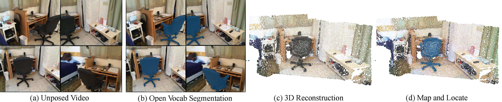
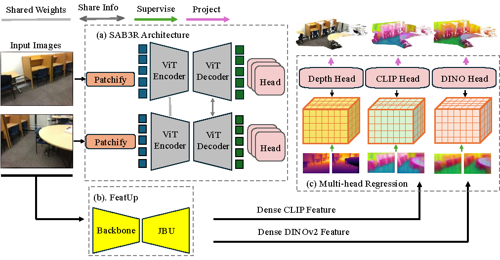

# SAB3R: Semantic-Augmented Backbone in 3D Reconstruction

<div align="center">

**3D-LLM/VLA Workshop @ CVPR 2025**

[**Xuweiyi Chen**](https://xuweiyichen.github.io/)<sup>*,1</sup> · [**Tian Xia**](https://tianx-ia.github.io/)<sup>*,2</sup> · [**Sihan Xu**](https://sihanxu.github.io/)<sup>2</sup> · [**Jed Jianing Yang**](https://jedyang.com/)<sup>2</sup> · [**Joyce Chai**](https://web.eecs.umich.edu/~chaijy/)<sup>2</sup> · [**Zezhou Cheng**](https://sites.google.com/site/zezhoucheng/)<sup>1</sup>

<sup>1</sup>University of Virginia · <sup>2</sup>University of Michigan

<sup>*</sup>Denotes Equal Contribution

---

[](https://www.arxiv.org/abs/2506.02112)
[](https://uva-computer-vision-lab.github.io/sab3r/)
[](https://huggingface.co/spaces/uva-cv-lab/SAB3R)
[](#)
[](https://github.com/UVA-Computer-Vision-Lab/sab-3r)

</div>

---



*Given an unposed input video, we show ground truth for: open-vocabulary semantic segmentation (per-pixel labels for the prompt "a black office chair"), 3D reconstruction (ground-truth point cloud), and the proposed **Map and Locate** task (open-vocabulary segmentation and point cloud). The Map and Locate task: (1) encompasses both 2D and 3D tasks, (2) bridges reconstruction and recognition, and (3) introduces practical questions in robotics and embodied AI.*

## Release Plan

- [x] Demo Release
- [x] Training and Inference Code Release
- [ ] Release Map and Locate Dataset

## Abstract

We introduce **Map and Locate**, a task that unifies open-vocabulary segmentation and 3D reconstruction from unposed videos. Our method, **SAB3R**, builds upon MASt3R and incorporates lightweight distillation from CLIP and DINOv2 to generate semantic point clouds in a single forward pass. SAB3R achieves superior performance compared to separate deployment of MASt3R and CLIP on the Map and Locate benchmark.

## Network Architecture



**SAB3R** distills dense features from CLIP and DINO into the MASt3R framework, enriching it with 2D semantic understanding. Each encoder-decoder pair operates on multi-view images, sharing weights and exchanging information to ensure consistent feature extraction across views. The model simultaneously generates depth, dense DINOv2, and dense CLIP features, which are then used for multi-view 3D reconstruction and semantic segmentation. This architecture enables SAB3R to seamlessly integrate 2D and 3D representations, achieving both geometric and semantic comprehension in a unified model.

## Repository Structure

```
sab3r/
├── demo/              # Gradio demo entry points (demo.py, app.py)
├── mast3r/            # MASt3R (Naver) with SAB3R additions — see "Attribution" below
├── dust3r/            # DUSt3R (Naver) with minor SAB3R additions — see "Attribution" below
├── config/            # Training configs (training_config.yaml, training_config_full.yaml)
├── eval/              # Evaluation utilities (NYU, VOC, segmentation)
├── train.py           # SAB3R training entry point
├── visloc.py          # Visual localization script (from DUSt3R, kept for parity)
├── requirements.txt
└── README.md
```

## Installation

1. Clone the repository:
```bash
git clone https://github.com/UVA-Computer-Vision-Lab/sab-3r.git
cd sab3r
```

2. Create the environment:
```bash
conda create -n sab3r python=3.11 cmake=3.14.0
conda activate sab3r
conda install pytorch torchvision pytorch-cuda=12.1 -c pytorch -c nvidia
pip install -r requirements.txt

# FeatUp (not on PyPI) — required for the CLIP/DINO semantic heads.
pip install git+https://github.com/mhamilton723/FeatUp
```

3. (Optional) Compile RoPE CUDA kernels for faster inference:
```bash
cd dust3r/croco/models/curope/
python setup.py build_ext --inplace
cd ../../../../
```

4. (Optional) Pre-download the CLIP BPE vocab (the demo will fetch it on first run):
```bash
mkdir -p ~/.cache/clip
cd ~/.cache/clip
wget https://github.com/openai/CLIP/raw/main/clip/bpe_simple_vocab_16e6.txt.gz
```

## Demo

The demo launches a Gradio UI for 3D reconstruction + open-vocabulary text queries.

**Checkpoint from HF Hub (default)**
```bash
python demo/demo.py \
    --model_name MASt3R_ViTLarge_BaseDecoder_512_catmlpdpt_metric \
    --local_network --share
```
This downloads `demo_ckpt/base/base.pt` from [`uva-cv-lab/SAB3R`](https://huggingface.co/uva-cv-lab/SAB3R) on first launch and caches it in `~/.cache/huggingface/`.

**Local checkpoint**
```bash
python demo/demo.py \
    --model_name MASt3R_ViTLarge_BaseDecoder_512_catmlpdpt_metric \
    --weights /path/to/your.pt \
    --local_network --share
```

**Override the HF Hub repo / filename**
```bash
python demo/demo.py \
    --model_name MASt3R_ViTLarge_BaseDecoder_512_catmlpdpt_metric \
    --model_repo your-org/your-sab3r-ckpt \
    --ckpt_filename model.pt
```

**Local dev with a checkpoint dropdown** — if you keep multiple checkpoints under a directory (one sub-directory per checkpoint, each holding `<name>.pt`), pass `--checkpoint_dir`:
```bash
python demo/demo.py --checkpoint_dir /path/to/ckpt_root --local_network --share
```

A hosted version of the demo is available at [huggingface.co/spaces/uva-cv-lab/SAB3R](https://huggingface.co/spaces/uva-cv-lab/SAB3R).

## Training

Two canonical configs are provided under `config/`:

- `training_config.yaml` — minimal dev recipe (CLIP distillation on a Co3D subset).
- `training_config_full.yaml` — full paper recipe (CLIP + DINO distillation on Habitat + ScanNet++ + ARKitScenes + Co3D).

Both reference paths relative to the repo root (e.g. `./data`, `./checkpoints`, `./outputs`); override them via Hydra:

```bash
torchrun --nproc_per_node=8 train.py \
    --config-name training_config_full \
    dataset_url=/path/to/data \
    output_url=/path/to/outputs
```

Set `WANDB_API_KEY` in your shell (do **not** commit it) if you want experiment tracking.

## Citation

```bibtex
@article{chen2025sab3rsemanticaugmentedbackbone3d,
  title={SAB3R: Semantic-Augmented Backbone in 3D Reconstruction},
  author={Xuweiyi Chen and Tian Xia and Sihan Xu and Jianing Yang and Joyce Chai and Zezhou Cheng},
  year={2025},
  eprint={2506.02112},
  archivePrefix={arXiv},
  primaryClass={cs.CV},
  url={https://arxiv.org/abs/2506.02112},
}
```

## Attribution

This repository is the SAB3R release. Two of its sub-directories are **not authored by the SAB3R team** — they are lightly modified vendored copies of open-source projects:

- [`mast3r/`](mast3r/) is forked from [naver/mast3r](https://github.com/naver/mast3r) (CC BY-NC-SA 4.0). Original authors:
  Vincent Leroy, Yohann Cabon, Jérôme Revaud et al. **SAB3R additions**: CLIP and DINOv2 distillation heads in `catmlp_dpt_head.py` and `model.py`; the `ConfFeatLoss` and `FeatRegr3D_ScaleShiftInv` losses in `losses.py`; and the open-vocabulary text-query overlay in the Gradio demo.
- [`dust3r/`](dust3r/) is forked from [naver/dust3r](https://github.com/naver/dust3r) (CC BY-NC-SA 4.0). Original authors:
  Shuzhe Wang, Vincent Leroy, Yohann Cabon, Boris Chidlovskii, Jerome Revaud. **SAB3R additions**: hydra entry point wiring for SAB3R training configs in `dust3r/dust3r/training.py`; minor additions to the Co3D dataset loader.

The CLIP/DINOv2 feature upsampler used by the demo is [FeatUp](https://github.com/mhamilton723/FeatUp) (Mark Hamilton et al.) — installed separately via pip.

We are grateful to all of the original authors for open-sourcing their work.

## License

The SAB3R code is distributed under the **CC BY-NC-SA 4.0** License — see [LICENSE](LICENSE). Files under `mast3r/` and `dust3r/` remain under their original CC BY-NC-SA 4.0 license from Naver Corporation.
